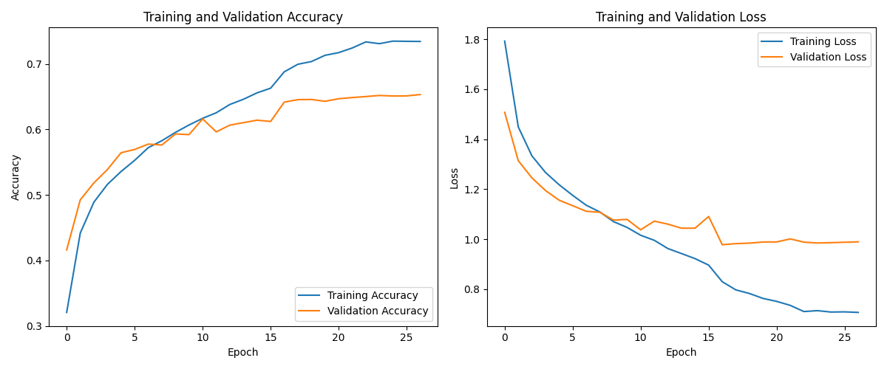
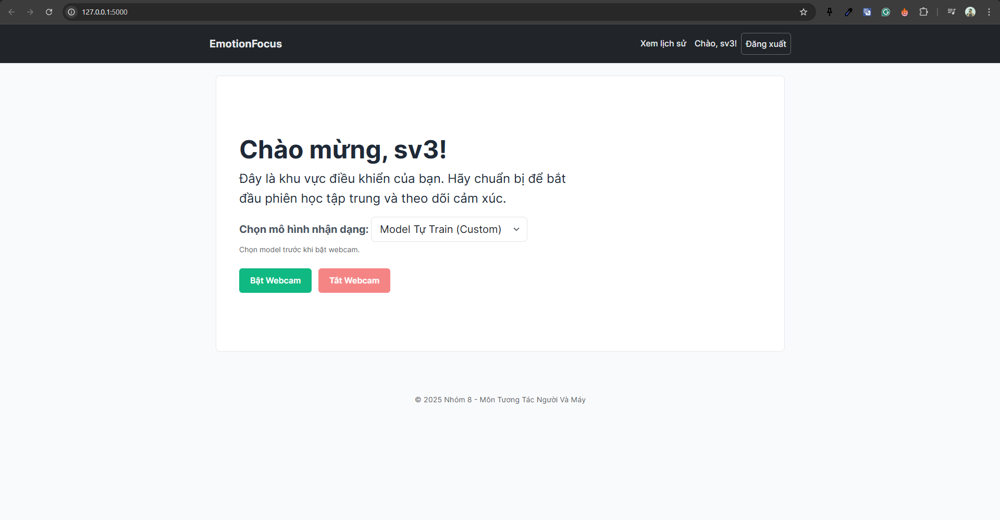
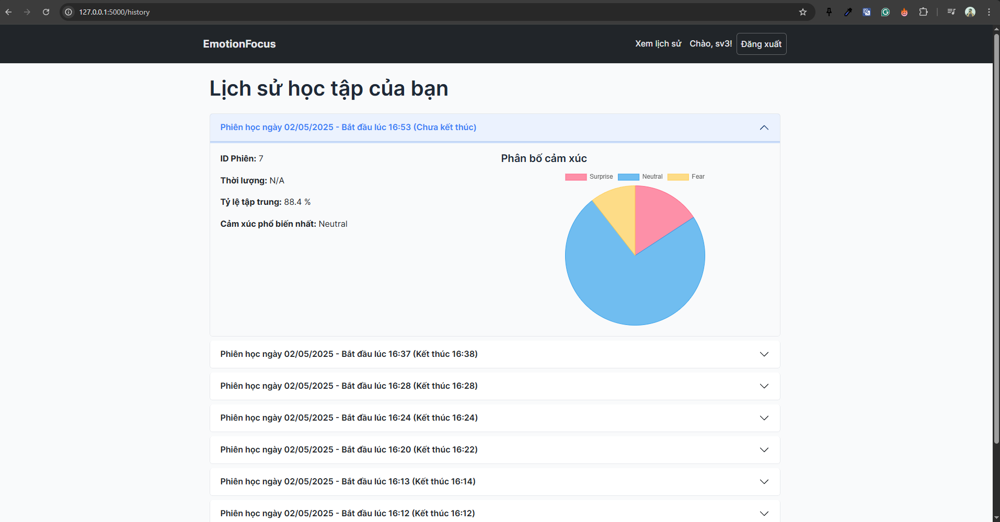

# Emotion Focus App



## Overview
The Emotion Focus App is a machine learning-powered application designed to detect and classify human emotions from facial expressions. It leverages Convolutional Neural Networks (CNNs) and pre-trained models to provide accurate emotion recognition.

## Features
- **Emotion Detection**: Classifies emotions into categories such as Angry, Disgust, Fear, Happy, Neutral, Sad, and Surprise.
- **User Authentication**: Secure login and registration system.
- **Interactive UI**: User-friendly interface built with HTML, CSS, and JavaScript.
- **Visualization**: Displays training history and performance metrics.

## Project Structure
```
config.py
emotion_cnn_model.h5
emotion_detection_model.h5
facenet_keras.h5
README.md
run.py
train_model.py
training_history_imgfolder.png
__pycache__/
app/
    __init__.py
    forms.py
    models.py
    routes.py
    services.py
    static/
        css/
            style.css
        js/
            main.js
    templates/
        base.html
        history.html
        index.html
        login.html
        register.html
dataset/
    test/
        angry/
        disgust/
        fear/
        happy/
        neutral/
        sad/
        surprise/
    train/
        angry/
        disgust/
        fear/
        happy/
        neutral/
        sad/
        surprise/
instance/
    app_data.db
```

## Installation
1. Clone the repository:
   ```bash
   git clone https://github.com/your-repo/emotion_focus_app.git
   ```
2. Navigate to the project directory:
   ```bash
   cd emotion_focus_app
   ```
3. Install the required dependencies:
   ```bash
   pip install -r requirements.txt
   ```

## Usage
1. Run the application:
   ```bash
   python run.py
   ```
2. Open your browser and navigate to `http://127.0.0.1:5000`.
3. Register or log in to start using the app.

## Dataset
The dataset is organized into `train` and `test` directories, each containing subdirectories for different emotion categories:
- Angry
- Disgust
- Fear
- Happy
- Neutral
- Sad
- Surprise

## Model Training
To train the model, use the `train_model.py` script. The training history and performance metrics will be saved as `training_history_imgfolder.png`.

## Screenshots
### Home Page


### Emotion Detection


### History Analysis



## Contributing
Contributions are welcome! Please fork the repository and submit a pull request.

## License
This project is licensed under the MIT License. See the LICENSE file for details.

## Contact
For any inquiries, please contact [your-email@example.com](haidang29productions@gmail.com).